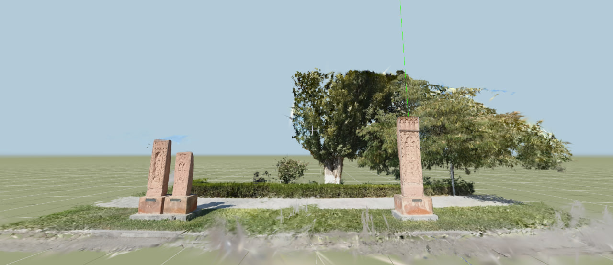
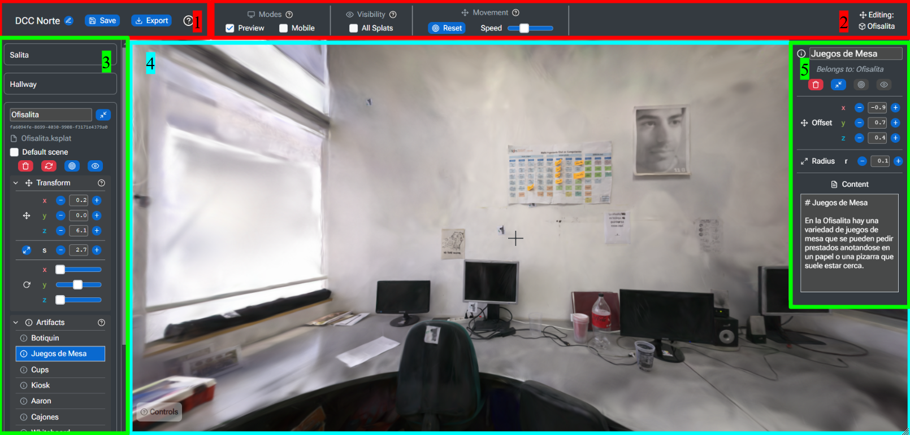
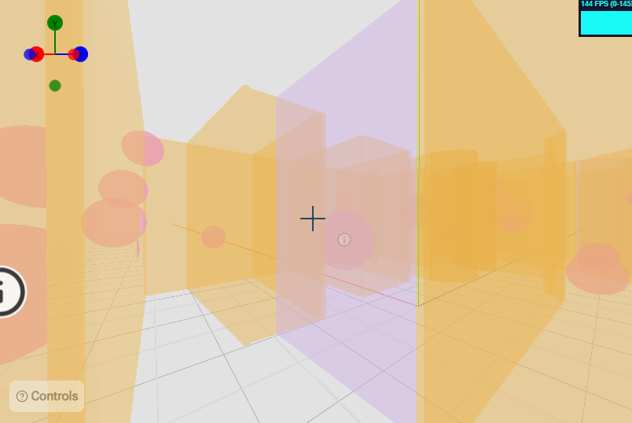
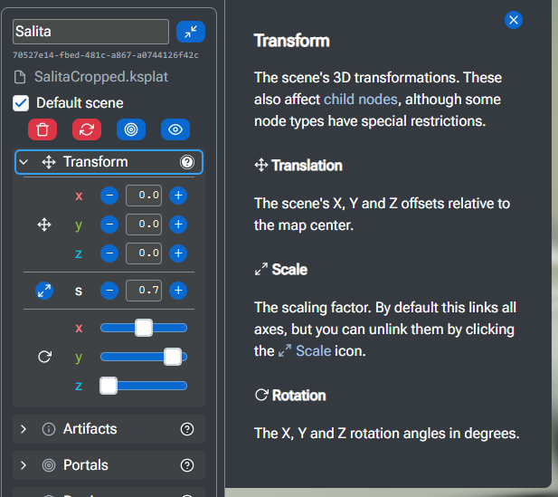
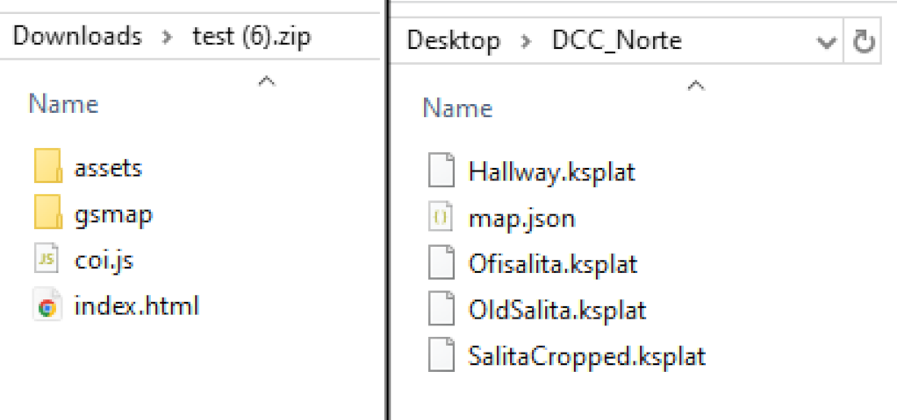
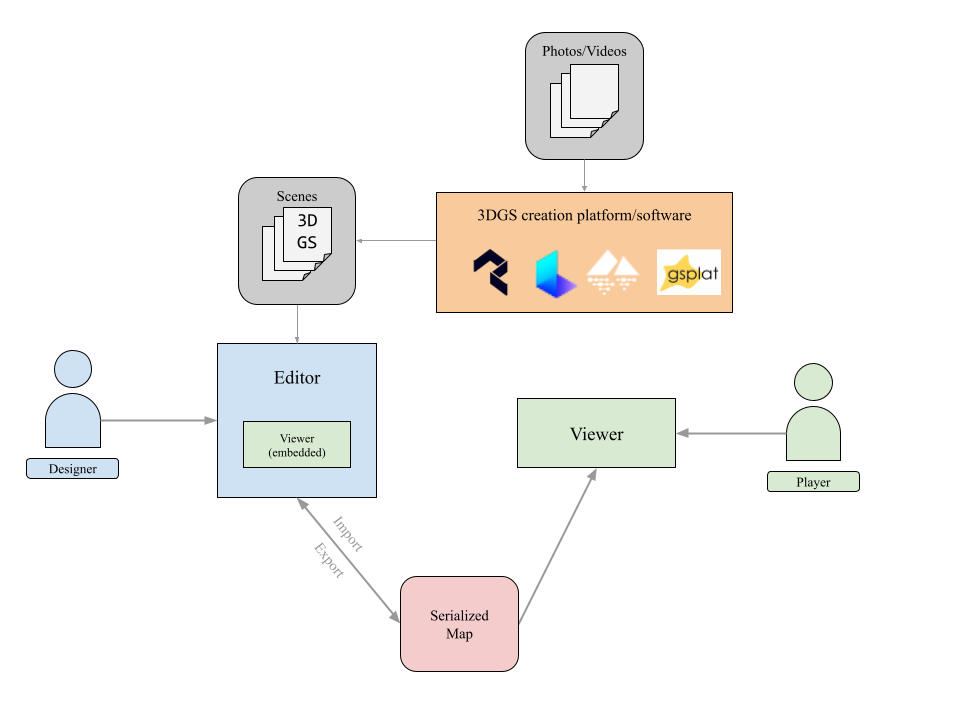
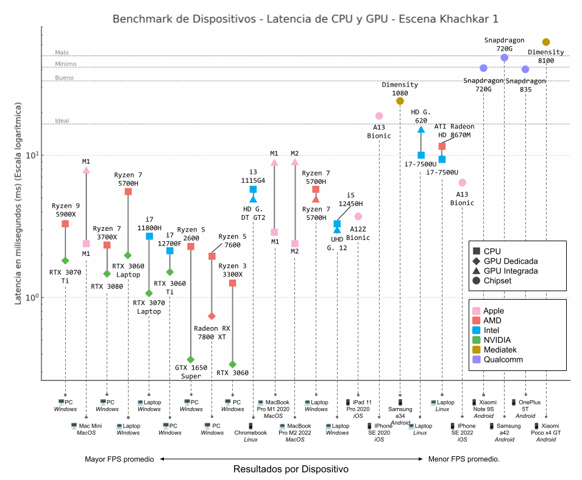

# Splatour 

"A web-based platform for 3D Gaussian Splatting (3DGS) map-making, immersive multimedia scene composition, and first-person virtual tours. Seamlessly integrate multiple 3DGS scenes into a single interactive environment with dynamic scene loading and unloading, support for interactive 3D and web objects, and effortless static site exporting. Optimized for both mobile and desktop browsers, ensuring smooth performance across a wide range of hardware.

Check out the demos at: [maps.eri.cl](https://maps.eri.cl/)




## Usage

*⚠ This project is currently in Alpha, and development is on hold until March 2025.*

### Project creation

1. Access the Editor at [maps.eri.cl](https://maps.eri.cl/#/editor). *(⚠ Unlike the viewer, the editor only works on Chromium browsers due to filesystem usage)*
2. Create an empty folder on your computer to store your project.
3. Click on the "Create" button in the Editor and select the folder you created.
4. Import and edit Gaussian Splat scenes, 3D models, and web content.

### Editing



1. **Project management:** Create, import, rename, save, and export projects.
2. **Editor tools:** Viewer settings, object visibilities, movement controls, and current state information.
3. **Scenes:** Add, remove, and edit scenes. Scenes are composed of a GS3D file, scene parameters, and child nodes.
4. **Viewer:** Preview of the current scene in the viewer.
5. **Nodes:** When a scene's child node is selected, its properties can be edited here.

### Nodes



Other than the 3DGS scenes themselves, you can add the following nodes to the world as children of a scene:

1. **Barriers:** Invisible walls that block movement.
2. **Portals:** Seamless teleportation points between scenes.
   1. For now, only *Edge Portals* are implemented. These are walls that when traversed, swap the active scene but do not change the camera's position (the idea being that you line up two 3DGS scenes in 3D space in the editor).
3. **Artifacts:** Interactive 3D objects with custom actions.
   1. For now, only *Web Artifacts* are implemented (Markdown-formatted interactive information nodes)
4. **Sky:** Background skybox for the scene (all scenes have one by default).

### Documentation

For more details about each feature, node type or design step, refer to internal documentation available by clicking on the **question mark icons** in the Editor. Every element is explained. For example:




### Saving & Exporting


1. **Save:** Save your project to the local filesystem. Projects are saved as a flat folder, with all assets as files and a `.json` file with all data.
2. **Import:** Import a project from a local folder. This will load all assets and data from the folder.
3. **Export:** Export your project as a static site. This will create a standalone viewer with all assets and data, which can be hosted on a web server.
4. **Hosting:** Host your exported project on a web server. For example, you can use Github Pages or Cloudflare Pages to host your project. The folder itself should be the root of the webpage, leaving the index.html as the default page. If you're more familiar with web development, you can also embed it or change the routes.

*Left: Exported project folder structure | Right: Splatour project folder.*



## Development

### Deployment

This is deployment for developing the demo or modifying the viewer or editor components. For deploying a virtual tour, see the usage section.

1. Install
2. Run locally
3. Build for deployment
4. Run preview

```bash
npm install
npm run dev
npm run build
npm run preview
```

### Resources & Technology

Static site with React + Typescript and Three.js.

#### Web

- [Github Pages](https://pages.github.com/) - Hosting.
- [Vite](https://vite.dev/guide/) - Build tool.
- [COI Serviceworker](https://github.com/gzuidhof/coi-serviceworker) - Workaround for CORS headers.
- [fflate](https://github.com/101arrowz/fflate) - Client-side zip compression.


#### JS

- [Typescript](https://www.typescriptlang.org/) - Static typing.
- [Prettier](https://prettier.io/) - Code formatting.
- [ESLint](https://eslint.org/) - Code linting.


#### React

- [React Router](https://reactrouter.com/en/main) - Path routing.
- [React Device Detect](https://github.com/duskload/react-device-detect#readme) - Device type detection.
- [Emotion](https://emotion.sh/docs/introduction) - CSS-in-JS styled components.
- [React Joystick Component](https://github.com/elmarti/react-joystick-component#readme) - Joystick component for mobile viewer.
- [Zustand](https://github.com/pmndrs/zustand) - Shared state management.
- [Headless UI](https://headlessui.com/react) - Modals and dropdowns.
- [React-Toastify](https://fkhadra.github.io/react-toastify/introduction/) - Toast notifications.

#### 3D

- [✨ GaussianSplats3D ✨](https://github.com/mkkellogg/GaussianSplats3D) - Gaussian Splat renderer. Absolutely essential, thanks @mkkellogg!
- [Three.js](https://threejs.org/) - 3D Rendering.
- [React Three Fiber](https://r3f.docs.pmnd.rs/getting-started/introduction) - Three.js as react components.
- [Drei](https://drei.docs.pmnd.rs/getting-started/introduction) - Extra Three.js components.
- [R3F-Perf](https://github.com/utsuboco/r3f-perf) - Benchmarking performance.


#### Images

- [Feather Icons](https://github.com/feathericons/react-feather) - Icon images.
- [Roboto](https://fonts.google.com/specimen/Roboto) - Base font.


#### Inspirations

- [Laboratorio31 exhibition](https://current-exhibition.com/laboratorio31/)
- [Laboratorio31 Interview](https://radiancefields.com/gaussian-splatting-brings-art-exhibitions-online-with-yulei)
- [Laboratorio31 Gaussian Splatting](https://medium.com/@heyulei/capture-images-for-gaussian-splatting-81d081bbc826)
- [Interior scan path for Gaussian Splats](https://www.youtube.com/watch?v=2ZX_5bOdKjo)
- [Marzipano](https://www.marzipano.net/) - 360 Panorama viewer & virtual tour creator.


### Project Structure

```bash
📦public    # Files for test maps and exports
📦docs      # Final build for demo page
📦patches   # Patches to used node modules
📦src       # Editor and Viewer source code
 ┣ 📂assets
 ┃ ┣ 📂css     # Base style
 ┃ ┣ 📂fonts   # Base font
 ┃ ┣ 📂images  # UI images
 ┃ ┣ 📂maps    # Example map .json files
 ┣ 📂components
 ┃ ┣ 📂editor
 ┃ ┃ ┣ 📂map  # Map management components
 ┃ ┃ ┣ 📂nodes
 ┃ ┃ ┃ ┣ 📂artifacts
 ┃ ┃ ┃ ┣ 📂barriers
 ┃ ┃ ┃ ┣ 📂portals
 ┃ ┃ ┃ ┗ 📂shared
 ┃ ┃ ┣ 📂scenes # GS3D Tools
 ┃ ┃ ┃ ┣ 📂card        # World object management
 ┃ ┃ ┃ ┣ 📂elements    # Child object management
 ┃ ┃ ┃ ┣ 📂manage      # Scene management
 ┃ ┃ ┃ ┣ 📂misc
 ┃ ┃ ┃ ┗ 📂properties  # World object tools
 ┃ ┃ ┗  📂toolbar      # General editor tools
 ┃ ┣ 📂input    # Re-usable input components
 ┃ ┣ 📂viewer
 ┃ ┃ ┣ 📂controls  # Movement & Camera
 ┃ ┃ ┣ 📂gsplats   # 3DGS Viewers & Scenes
 ┃ ┃ ┣ 📂interface # Viewer UI
 ┃ ┃ ┣ 📂nodes     # 3D & Interactive Objects
 ┃ ┃ ┃ ┣ 📂artifacts
 ┃ ┃ ┃ ┣ 📂barriers
 ┃ ┃ ┃ ┗ 📂portals
 ┃ ┃ ┗ 📂world    # Environmental Objects
 ┣ 📂hooks # App state and custom hooks
 ┣ 📂model # Data model (maps, scenes, etc.)
 ┃ ┣ 📜GSMap.ts
 ┃ ┣ 📜GSNode.ts
 ┃ ┣ 📜GSScene.ts
 ┃ ┗ 📜GSSky.ts
 ┣ 📂pages # Demo pages
 ┃ ┣ 📂benchmarks
 ┃ ┗ 📂demos
 ┣ 📂utils     # Utility and helper functions
 ┗ 📜main.tsx  # React entry point
📜index.html   # Vite entry point
```

### Project architecture




Splatour is designed such that:

1. There is a shared file format for projects (flat folder + json), which can be saved and loaded in the editor or viewed in the viewer.
2. The viewer is self-contained, so it can be standalone, embedded or used (with enhanced features) in the editor.
3. The editor works with the local filesystem, no accounts or servers required.
4. The editor can export a project as a static site (splats + data + standalone viewer), which can be hosted on sites like Github Pages or Cloudflare.

### Benchmarks

Some benchmarks (GPU and CPU latency) from the demo benchmark scene. All benchmarks were run using a fixed resolution. Results are sorted average FPS from left (higher) to right (lower).



*(my thesis is in spanish if you're wondering why the chart is in spanish)*

## Contributing

Contribution guidelines will be defined once my thesis has been succesfully defended 😰. For now, feel free to leave issues or make pull requests, I just can't promise I'll be able to accept or handle them.